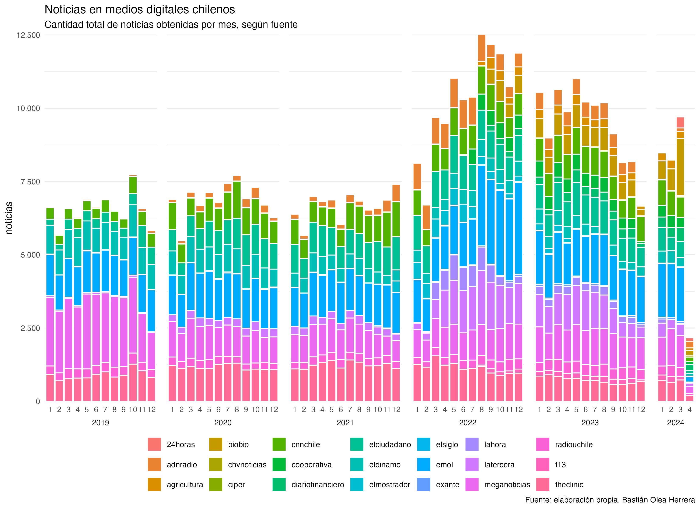

# Análisis de prensa chilena

Proyecto de ciencia de datos desarrollado en R para analizar texto de noticias chilenas. Comprende módulos para realizar web scraping de sitios web de prensa para obtener el texto de sus noticias, procesos para transformar ese texto en palabras (tokens), y procesos para analizar dicho corpus de palabras usando distintas técnicas.

Actualmente, el corpus de noticias obtenido supera las 500.000 noticias individuales, abarcando más de 21 fuentes periodísticas distintas.

## Principales hallazgos

_próximamente..._

## Estructura del código

El script `prensa.R` es un orquestador desde el que se pueden realizar todos los pasos de obtención, procesamiento y análisis de datos. Muchos de estos procesos son altamente demandantes en términos de hardware, dado que estamos trabajando con bases de datos de cientos de miles de observaciones con columnas que contienen miles de palabras por cada fila, o bien, tablas con cientos de millones de filas que contienen los términos de todo el corpus. Por lo anterior, todos estos procesos han sido optimizados para usar las funciones más eficientes (luego de realizar varios benchmarks), reducir el costo de memoria de las operaciones (dado que la magnitud de los datos es imposible de mantener en memoria en ordenadores comunes), y aprovechar al máximo el procesamiento paralelo en múltiples núcleos de CPU.

- `prensa_obtener_datos.R` ejecuta múltiples procesos simultáneos (usando _background jobs_ de RStudio), que corresponden a scripts que realizan scraping de un sitio web en específico, y guarda sus resultados en un archivo individual en `resultados/{modulo}/`. Se puede ejecutar diariamente para mantener actualizadas las fuentes de datos con las noticias recientes.
- `prensa_cargar_datos.R` carga los datos scrapeados obtenidos por el paso anterior, los une, limpia y guarda en una sola base de datos, una noticia por fila. La carga y unión de los resultados individuales se realiza de forma paralela usando `{furrr}`. La limpieza de texto es un procedimiento computacionalmente intenso (dado que implica detectar patrones en el texto para eliminar símbolos e interpretar fechas), por lo que los datos cargados son divididos en piezas más pequeñas, y cada pieza se procesa en un proceso paralelo para aprovechar múltiples procesadores, y el resultado de cada limpieza se guarda individualmente en la carpeta `datos/preprocesados/` para evitar mantener los datos en memoria. Finalmente, estas piezas procesadas son vueltas a cargar y unidas como un solo archivo, `datos/prensa_datos.feather`, que es la base principal que contiene todas las noticias ordenadas, limpiadas, e individualizadas con un ID único.
- `prensa_procesar_texto.R` es el proceso en el que se tokenizan los textos de las noticias; es decir, se transforma una cadena de texto en todas las palabras individuales que conforman el cuerpo de la noticia, eliminando las _stopwords_ o palabras que son irrelevantes para el significado del texto. Para procesar la tokenizacion de forma eficiente, la base de datos se divide en piezas pequeñas de igual tamaño para ser procesadas en paralelo y guardadas individualmente, igual que en el paso anterior. Esto es para reducir la cantidad de información que se debe mantener cargada en la memoria, al relevar los resultados al disco duro. De este proceso se obtiene `datos/prensa_palabras.feather`, una base de datos con más de 90 millones de filas, donde cada fila es una palabra asociada al ID único de la noticia de la cual proviene.
- `prensa_calcular_conteo.R` carga la base de datos por palabras, y cuenta la frecuencia de palabras por noticia de forma paralela, para obtener `datos/prensa_palabras_conteo.parquet`, una base similar a la anterior, pero cuyas palabras son únicas por cada noticia, y contiene la frecuencia de cada término por noticia.
- `prensa_calcular_correlacion.R` para calcular correlación entre palabras dentro de noticias, retornando una base con palabras y sus pares correlacionados.
- `prensa_calcular_topicos.R` donde se procesan las noticias para identificar topicos de forma automática y no supervizada mediante machine learning.
- `prensa_detectar_temas.R` donde se evalúa la presencia de términos específicos en cada noticia, y en base al porcentaje de términos coincidentes con respecto a las palabras totales, etiquetar cada noticia con la temática que engloba a los términos; por ejemplo, noticias donde más de 3% de las palabras tienen que ver con robos, asaltos, etc., serán categorizadas como noticias sobre delincuencia.
- Y más...

_Debido a la cantidad de trabajo y tiempo de procesamiento de este proyecto, actualmente no estoy compartiendo las carpetas `modulos`, `resultados` o `datos`, que contienen, respectivamente, los scripts de scraping, los resultados crudos del scraping, y los resultados procesados del scraping._

----
 
Puedes ver mis otros proyectos de ciencia de datos en R [en mi portafolio de **visualizadores de datos sociales en R**](https://bastianolea.github.io/shiny_apps/)
